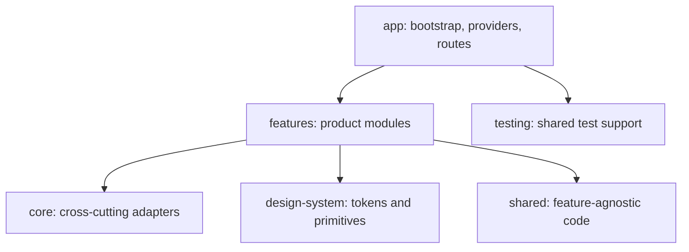

# Mobile module structure

## Physical folders created now

- `app/bootstrap`, `app/providers`, `app/routes`
- `assets/fonts`, `assets/icons`, `assets/images`, `assets/lottie`
- `core/analytics`, `authentication`, `config`, `errors`, `feature-flags`, `network`, `offline`, `security`, `storage`
- `design-system/animations`, `components`, `icons`, `layouts`, `theme`, `tokens`
- `shared/components`, `constants`, `hooks`, `types`, `utils`, `widgets`
- `testing/e2e`, `factories`, `mocks`, `renderers`
- `native/android`, `native/ios`, and `localization`
- Feature modules: `analytics`, `authentication`, `budget`, `dashboard`, `expenses`, `finance`, `friends`, `leaderboard`, `notifications`, `profile`, `reminders`, `settlements`, `stops`, `templates`, `transactions`, and `trip`.

Each feature already has the canonical child folders listed in [the feature module contract](../src/features/README.md). They remain deliberately empty: product UI, navigation registrations, and business behaviour are out of scope for this structural phase.
