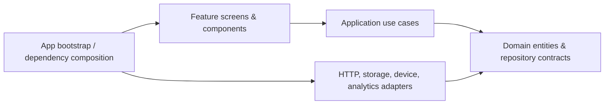
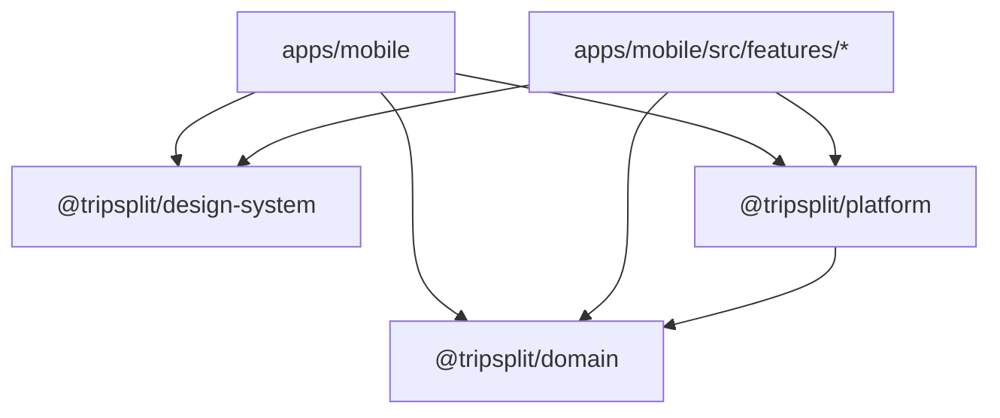

# Architecture

## Principles

The mobile app is a native-first React Native CLI application. Each product capability is a vertical feature module. Screens compose view models and user actions; they never access HTTP, storage, or native APIs directly.



Dependencies point inward. `packages/domain` must never import React Native. Infrastructure is supplied at the composition root, which keeps vendor SDKs replaceable and testable.

## State model

| State            | Owner                                      | Rule                                                                               |
| ---------------- | ------------------------------------------ | ---------------------------------------------------------------------------------- |
| Server data      | TanStack Query                             | Queries and mutations own cache, pagination, optimistic updates, and invalidation. |
| UI state         | Feature-local React state or Zustand slice | Do not promote a value globally unless two independently mounted areas need it.    |
| Persistent state | Platform storage repositories              | Only explicit, versioned schemas persist across launches.                          |
| Authentication   | Auth session repository                    | Access and refresh tokens are encrypted and unavailable to UI code.                |
| Network status   | Network service                            | Drives retry, offline messaging, and the mutation queue.                           |

## Cross-cutting policy

- The `HttpClient` is the single network boundary: cancellation, retry policy, auth refresh, request IDs, mapped errors, observability, and offline-safe mutation metadata belong there.
- Remote configuration, analytics, crash reporting, certificate pinning, and OTA delivery are provider interfaces. A provider can be selected per brand/environment without exposing a vendor SDK to feature code.
- The design system exposes semantic tokens only. Features use no raw colour, spacing, or typography literals.
- A single `AppBackground` is composed once by the app shell. Screens and cards remain transparent or use semantic surface tokens.

## Feature shape

```
features/<feature>/
  api/            transport DTOs and repository adapters
  application/    commands, queries, and use cases
  components/     feature-specific visual composition
  domain/         entities, policies, repository ports
  hooks/          presentation adapters
  navigation/     typed route declarations
  screens/        thin screen compositions
  tests/          unit, component, integration tests
```

## Dependency graph



Feature modules must not import another feature's internal files. Share only a domain contract, a design-system primitive, or a deliberately promoted public capability.
