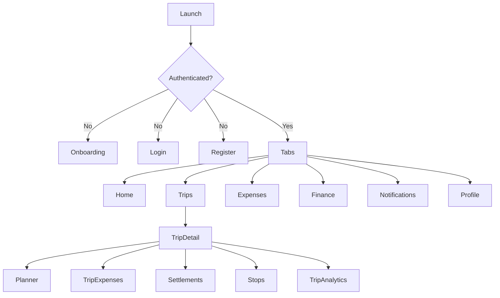

# Reference migration inventory

This inventory was derived from the Expo reference application. It is a product and contract inventory, not source to copy. The new implementation will retain only validated user-facing behaviour.

## Navigation graph

## Screen catalogue

| Area           | Screens / flows                                                                                                                       |
| -------------- | ------------------------------------------------------------------------------------------------------------------------------------- |
| Authentication | Onboarding, login, registration, password recovery, set password, Google sign-in, session management, biometric lock.                 |
| Home           | Home, dashboard, quick actions, insights, notifications.                                                                              |
| Trips          | List, create, join by invite, detail, summary, story, settings, members/invitations, stops, map, leaderboard, analytics and insights. |
| Trip planner   | Itinerary, booking/flight/accommodation/transport planning, budget, checklist, packing, documents, contacts, activation, completion.  |
| Expenses       | Global list/detail, trip/stop list, add/edit, categories, splits, receipt upload, comments, archive/restore, analytics.               |
| Settlements    | Trip calculation, payment/confirm/dispute/retry, history, export, personal settlement list.                                           |
| Finance        | Dashboard, transactions, budgets, bills, goals, debt, categories/tags, trends, analytics, exports, monthly/yearly reports.            |
| Social         | Friends, requests, search, person detail, trip invitations, privacy controls.                                                         |
| Engagement     | Reminders, achievements, year in review, feedback, notifications.                                                                     |
| Profile        | Profile/dashboard/edit, banking/UPI, reviews, appearance, privacy, password, security sessions, danger zone.                          |

## API capability catalogue

| Capability             | Reference API families                                                                                                                               |
| ---------------------- | ---------------------------------------------------------------------------------------------------------------------------------------------------- |
| Identity               | `/auth/*`, `/users/preferences`, `/users/profile`, `/users/banking`, FCM token management.                                                           |
| Trips and planner      | `/trips`, templates, stops, members, invites, join requests, plan/budget/checklist/itinerary/bookings/packing/documents/contacts/progress lifecycle. |
| Money                  | `/expenses/*`, `/settlements/*`, `/finance/*`, `/receipts/*`.                                                                                        |
| Social                 | `/friends/*`, `/invitations/*`, `/person/*`, `/users/search`.                                                                                        |
| Insight and engagement | `/dashboard`, `/analytics/*`, `/achievements/*`, `/reminders/*`, `/notifications/*`, `/feedback`.                                                    |
| Location               | `/location/reverse-geocode`, search, nearby/suggested stops, countries, currency.                                                                    |

## Deliberate corrections

- Consolidate overlapping UI, theme, and presentation-model implementations into one design system.
- Replace feature-level API hooks with domain repositories and application use cases.
- Remove direct Expo service usage; select native adapters by capability.
- Treat reference API payloads as untrusted DTOs and validate them at the network boundary before mapping them to domain entities.
